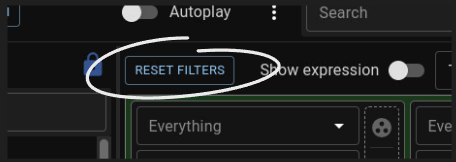
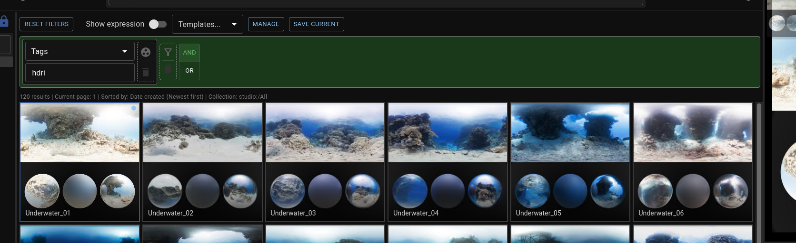
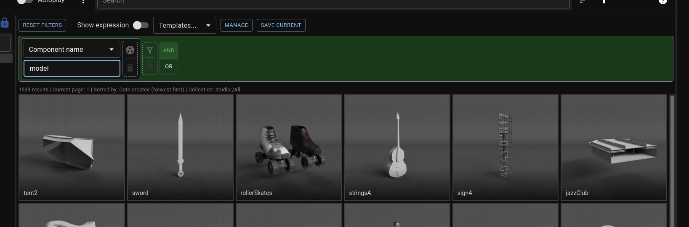
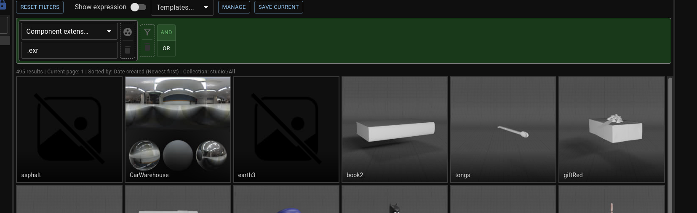
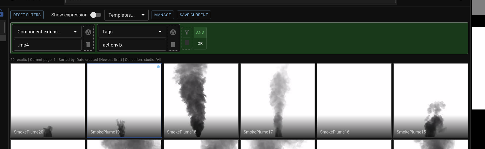
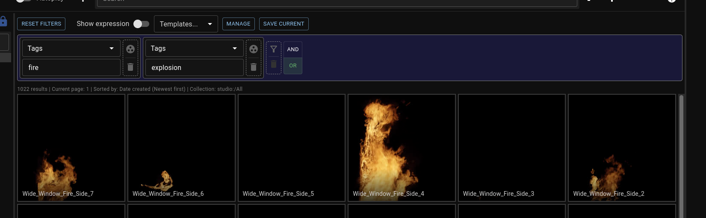
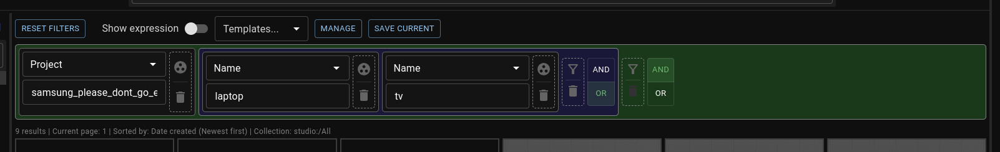

import ReactPlayer from "react-player";
import OpenFilterBarVideo from "../assets/open_filter_bar.mp4";

Next to the filter bar at the top of the UI you will find the filters button. Use it to get access to the full filtering features, including bitwise operations.

<ReactPlayer playing loop controls width="100%" height="auto" url={OpenFilterBarVideo} /> 

To stop using filters simply hit the "Reset Filters" button

## Filters
Each filter looks for values on various fields on assets. A few examples are:

A filter for the value “hdri” in tags

A filter for components called “model”

A filter for components that end in “.exr”

## Filter Groups
A filter group contains multiple filters. It’s truthful depending on the state of the AND/OR buttons on the filter group. AND will be truthful when all filters are true, while OR is truthful when at least one of them is.

For example you can have a filter group with 2 filters inside, one looking for assets tagged with “vehicle” and the other one looking for “.abc” components. If the filter group is set to “AND” it’ll get you all assets that are both tagged with vehicle and have alembic components.

A filter for assets with an .mp4 file that *also* have "actionvfx" in their tags

A filter for assets with either "fire" in their tags or "explosion" in their tags

You can also nest filters and groups in order to create more complex queries

A filter for assets from project "samsung_please_dont_go_e005676" that have either "tv" or "laptop" in their name

