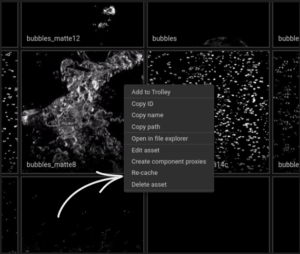

Warehouse stores assets on disk but a lot of their data is cached, including their name, tags, description, components and previews. This allows for much faster UI interactions. This cache is automatically updated whenever an asset is changed via the UI or the APIs, but if for any reason you expect an asset to look different (like after manually changing its files on disk) you can trigger a recache via the asset's right click menu.

