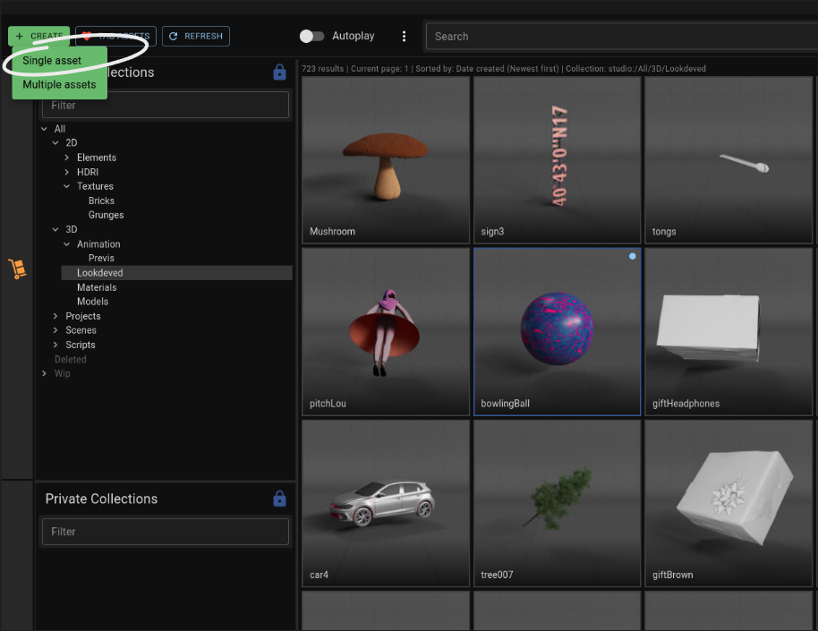
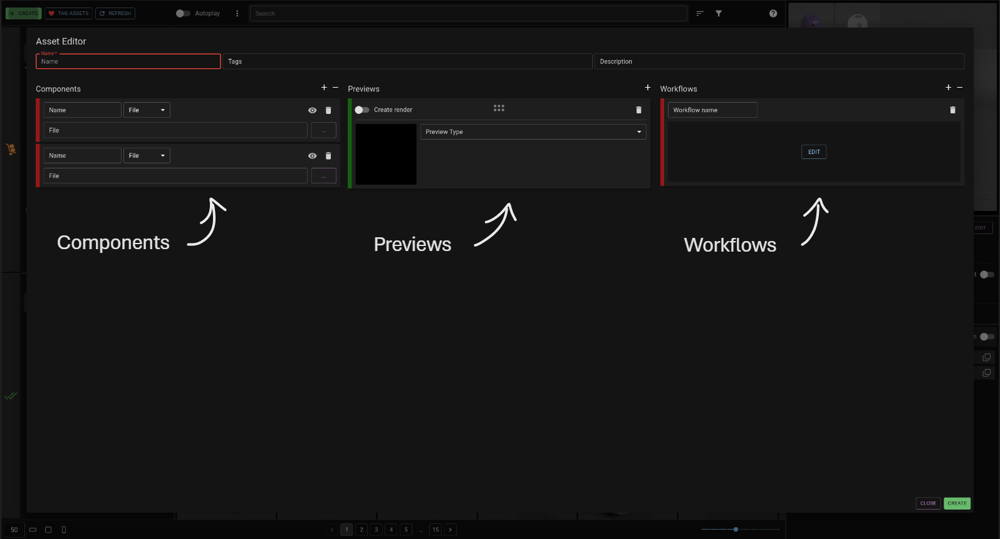
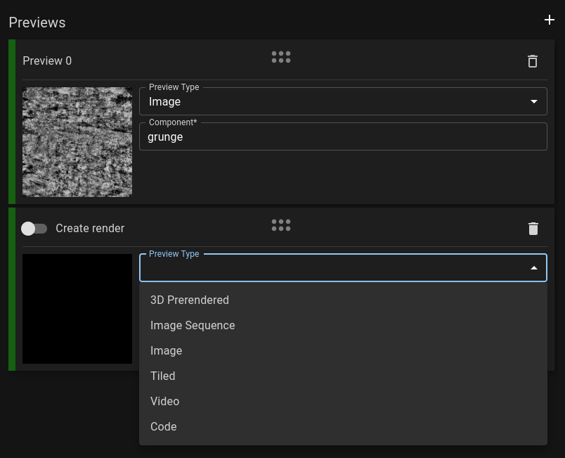
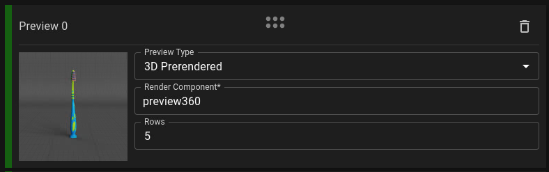
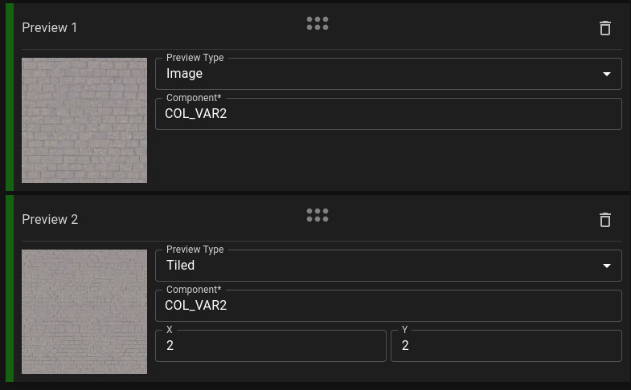
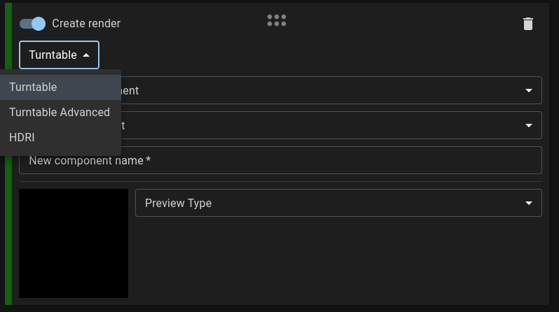
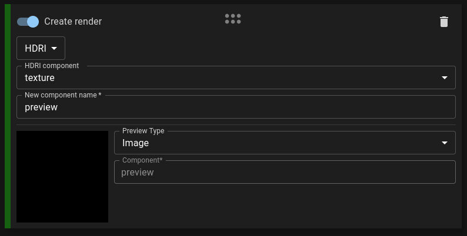

import ReactPlayer from "react-player";
import NewAssetVideo from "../assets/new_asset.mp4";

Hit the “Create” button at the top left of the UI and select “Single”. A window will pop that is separated into 3 columns, as well as some basic details at the very top.

<ReactPlayer playing loop controls width="100%" height="auto" url={NewAssetVideo} /> 

<!--  -->

Firstly fill in its name and tags (and optionally the description) at the top of the UI and head over to the “Components” column.

Each component will require a name and either a filepath or some file content to be pasted in. Select the appropriate options and when ready click the “Create” button at the bottom right of the screen.

# Previews

The second column is for telling the app how to display components. Use the "Preview Type" field to select one of the available preview types and the "Component" field to select which of the asset components (on the left column) to use.

Some preview types will have extra options for you to adjust.

For some assets it makes sense to generate a new render to showcase them. For example a 3D model can have a rendered turntable, or a HDRI can have be displayed next to shader balls. In the same column you may flick the "Create render" switch in order to generate the render as well as the previews in one go.

:::info
Previews always display components, which means if you were to generate a render for previewing purposes it will also need to be a component. Using the "Create render" switch will actually add a new component to the asset for you and this is what the "New component name" field refers to.
:::

# Workflows

Coming soonish...
