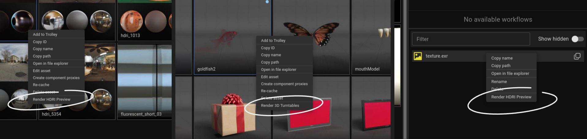

import ReactPlayer from "react-player";
import ActionsVideo from "../assets/running_actions.mp4";

Actions can be found under the right click menu on asset tiles and components.

Depending on your current selection you may or may not see all available actions.
They are filtered by available components. For example if an action is looking for a model (.abc) file it won't appear on HDRI assets that only contain image components.

They are used to trigger complex tasks which can run in the background. Currently there's 2 available actions for rendering previews of model and HDRI assets.

<ReactPlayer playing loop controls width="100%" height="auto" url={ActionsVideo} /> 
