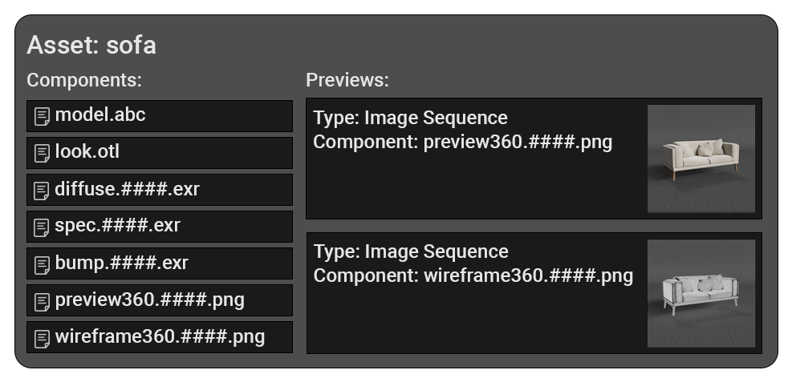
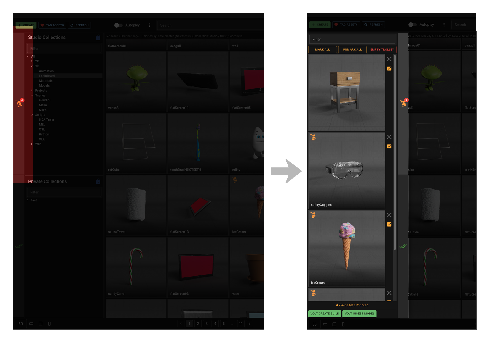
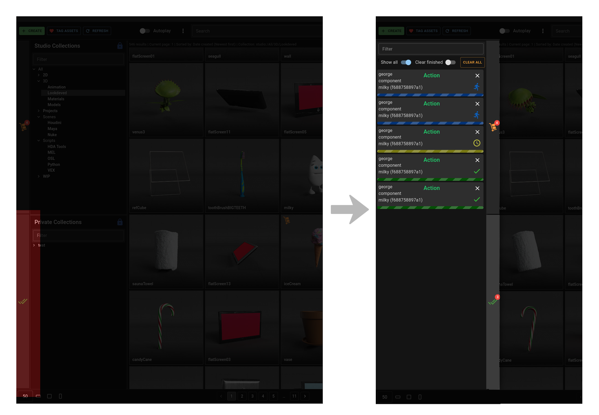

# Concepts

# Asset
An asset in Warehouse is a collection of files and file sequences called components.
There’s no asset type system and any single asset can be comprised of very different kinds of files.
For example a “light snowfall” asset could come with a few video element components to be used in Nuke or After Effects and it could also come with a baked geometry cache to be used in Houdini and Maya scenes. It could even include a HDA component that can run a live simulation as well as create the relevant shaders.
Assets can also come with various previews which is what browsing artists use to get an idea of what the asset looks like.

# Component
Components are the files and file sequences that assets are made of. They can be virtually any kind of file type. A few examples of what components can be are:

* A jpeg file texture - `texture.jpg`
* An exr sequence - `render_acescg.####.exr`
* A collection of nuke nodes ready to be pasted in a scene - `tool.py`
* A Houdini scene - `scene.hip`
* A Houdini digital asset - `tool.hda`
* A nuke script - `scene.nk`
* A Maya MEL snippet - `script.mel`

Each one of these components can either be copied straight from the library or imported into Volt using workflows.
Components also have tasks that can be performed on them via the right click menu.

# Previews
The flexibility of what an asset can possibly consist of creates the issue of properly showcasing what it looks like. Thankfully assets can come with previews which are a way of rendering components in appropriate way for the browsing artists to get a better idea of what they’ll be importing.

Currently previews can be one the following:
* Images
* Tiled images
* Image sequences
* Videos
* Code
<!-- * 3D views -->

# Actions
Python scripts that can be run on entire assets or individual components. They can be found on the right click context menu and are filtered depending on what the entity is. Some actions specific to `.jpeg` files will not appear on an alembic `.abc` component. An example would be the “Render 3D Turntables" action (on alembic model components) that create beauty and wireframe turntable renders of it and add them as components to the asset.

# Workflows
Set of instructions that perform complex tasks. An example would be ingesting an asset to Volt, with the workflow first asking the user what to name said asset and which Volt workarea to ingest it to.

# Trolley
When browsing the library and find an interesting asset you can add it to the trolley. Once finished browsing you can use it to easily review and compare added assets and run workflows on them.

# Collections
Dynamic, rule based categorisation of assets. You will find “Studio” and “Private” collections on the UI, with the former being shared between users and the latter only visible to you. Both of them support the same features including nesting.

# Task queue
Most of your interactions with the library are processed in real time behind the scenes. There are however slower tasks like running workflows and publishing assets that take a bit longer. These will be displayed on the task queue so you can keep track of their status.

<!-- # Web UI
Warehouse primary runs as a standalone app but you can also view it through a web browser at [URL coming soon]. This is a slightly stripped down version of the full app but can be loaded inside supported DCC or on any machine connected to the ETC network. -->
