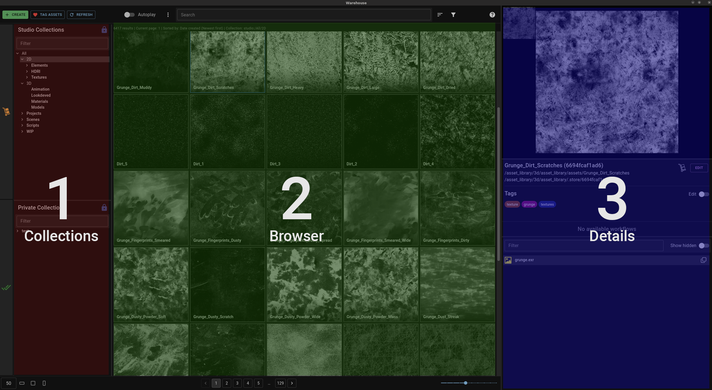
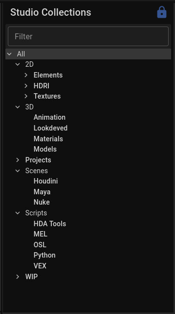
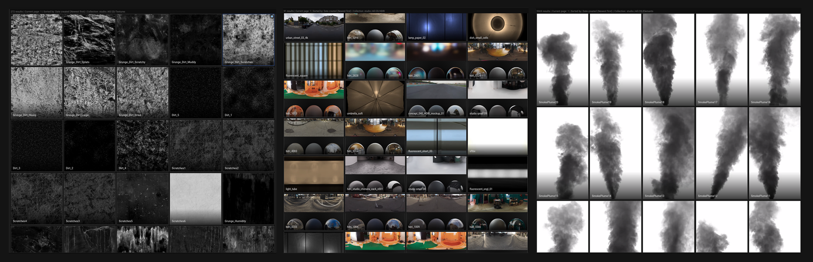
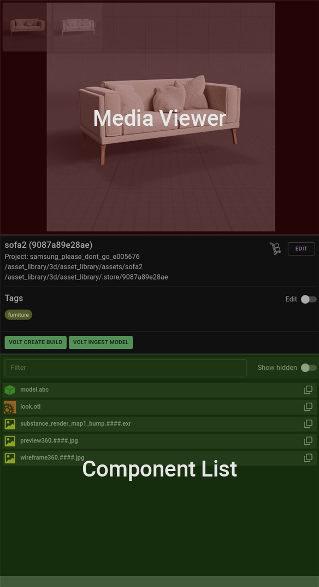

The UI is divided into 3 main sections, the Collections (left), Browser (centre) and Details (right).

## Collections
Warehouse stores assets in a flat hierarchy and collections is how they get organised into (nested) categories. This happens dynamically using rules which allows assets to appear under multiple collections at a time, as well as have newly added assets automatically be available under the correct categories.

# Browser
The browser will present currently filtered assets on a grid, also displaying the first preview of each asset. You will learn about previews later on but for now you can think of them as different ways to visualise an asset. These grid items, called “asset tiles”, can be resized and viewed in different aspect ratios via the controls at the bottom of the UI. You are also able to change how many assets will load per page.

Left clicking any asset will select it, while right clicking will open a context menu and let you perform useful actions, like copying its path.

A quick way to filter assets is by using the field at the centre top of the UI, but keep in mind your results are also filtered by your selected collection.

:::caution
Forgetting about the selected collection is a common source of confusion when searching for assets using the search bar. If you want to search the entire library please select the top level "All" collection.
:::

# Asset Details
On the right side of the UI you will find the details of your current selection. At the very top there’s the media viewer, below that some basic info about the asset like its name and path, followed by its tags. At the bottom there’s the component list.

## Media Viewer
Assets will (usually) come with previews, which are displayed here. The top area of the viewer can be used to select between them.

## Component List
This is where you will find the list of files that make up your selected asset. Right clicking a component will pop a menu with useful actions such as copying the filepath to your clipboard.
